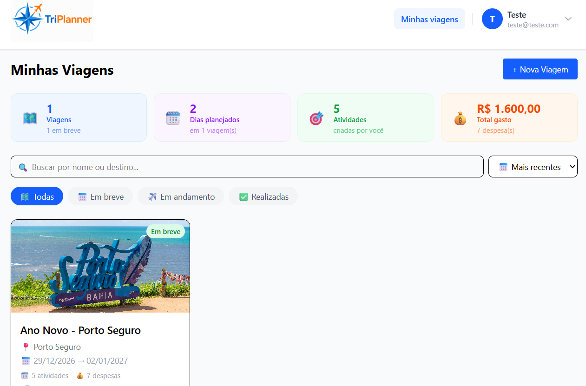
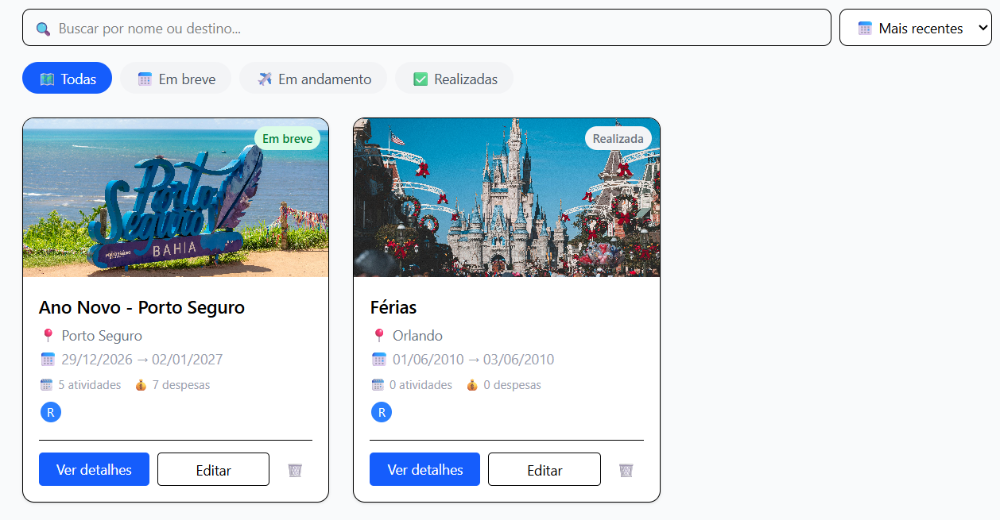
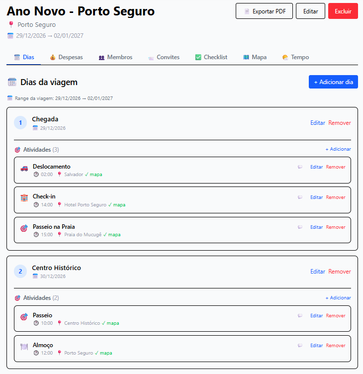
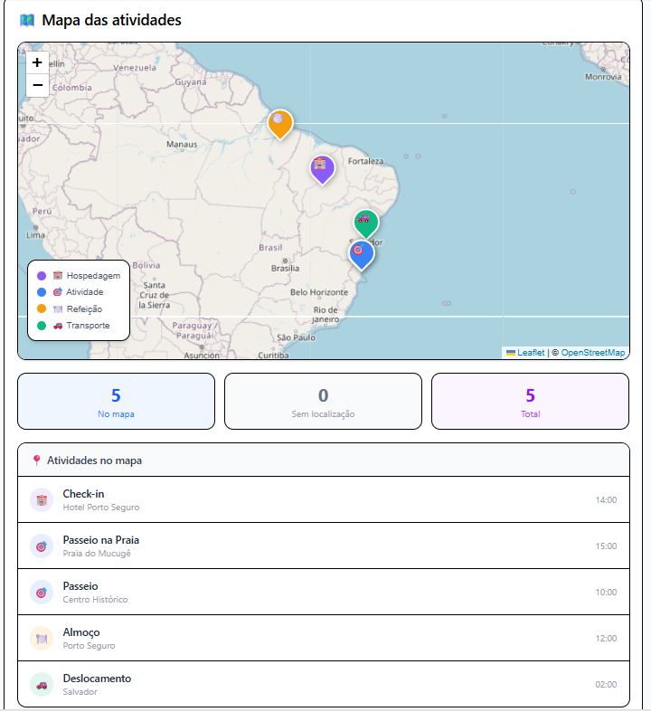
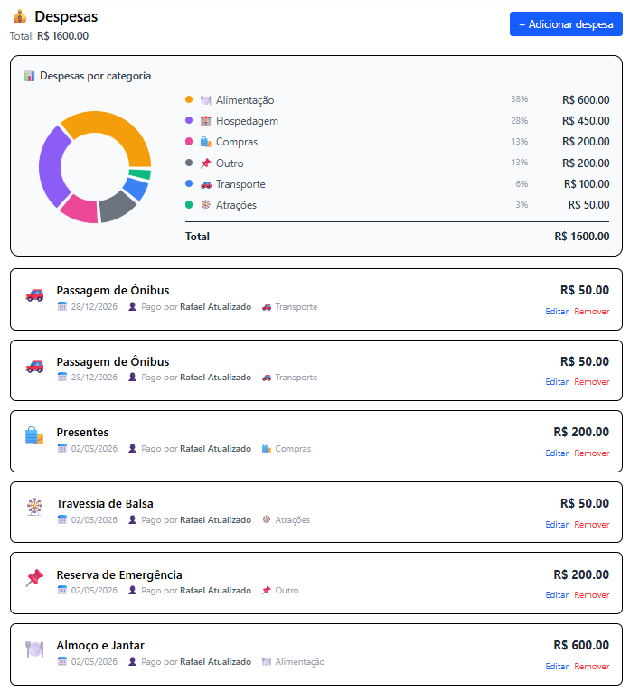
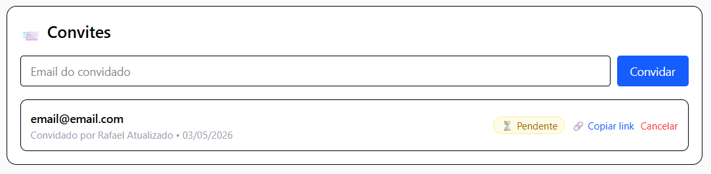
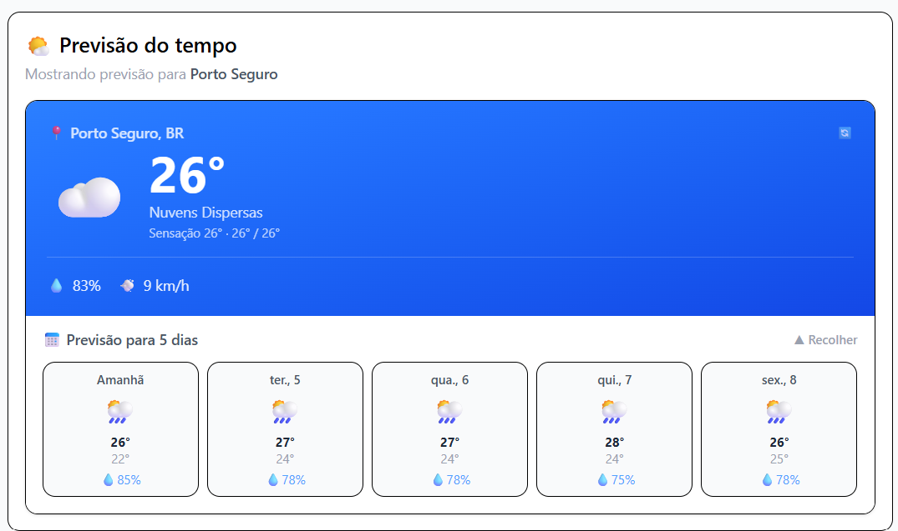

<div align="center">


# TriPlanner

**Planejador de viagens colaborativo**

Organize itinerários, despesas, mapas e checklist com seus amigos e familiares em um só lugar.

[Funcionalidades](#-funcionalidades) •
[Tecnologias](#-tecnologias) •
[Screenshots](#-screenshots) •
[Como rodar](#-como-rodar-localmente) •
[Estrutura](#-estrutura-do-projeto)


</div>

---

## 📖 Sobre o Projeto

TriPlanner é uma aplicação web full-stack desenvolvida para resolver a dificuldade de
**organizar viagens em grupo**. 

Inspirado em ferramentas como TripIt e Wanderlog, o sistema centraliza 
itinerário, despesas, localização, checklist e comunicação entre os 
viajantes, tudo em uma interface responsiva.

> 💡 Projeto desenvolvido como portfólio pessoal, explorando conceitos modernos 
> de desenvolvimento web full-stack, autenticação, autorização baseada em 
> papéis (RBAC), integração com APIs externas e UX colaborativa em tempo real.

---

## ✨ Funcionalidades

### 🔐 Autenticação e Autorização
- Cadastro e login com email/senha (criptografia bcrypt)
- Autenticação via JWT com expiração configurável
- Sistema de papéis: **OWNER**, **EDITOR**, **VIEWER**
- Permissões granulares por funcionalidade

### ✈️ Gestão de Viagens
- Criação, edição e exclusão de viagens
- Upload de foto de capa personalizada
- Definição de destino, datas e descrição
- Validação de período (data fim ≥ data início)
- Listagem com contadores de atividades e despesas

### 🗓️ Itinerário Dia a Dia
- Adicionar dias dentro do range da viagem
- Validação automática de datas
- Validação em tempo real com feedback instantâneo
- Reordenação automática
- Tratamento robusto de timezone (UTC normalizado)

### 🎯 Atividades por Dia
- 5 categorias: Atividade, Refeição, Transporte, Hospedagem, Outro
- Horário de início configurável
- Geolocalização com seletor de mapa interativo
- Sistema de **comentários colaborativos** por atividade

### 🗺️ Mapa Interativo
- Visualização de todas as atividades georreferenciadas
- Marcadores customizados por categoria (cores e ícones)
- Popup com detalhes ao clicar no marcador
- Auto-fit do zoom para mostrar todas as paradas
- Legenda dinâmica baseada nos tipos presentes
- Lista lateral sincronizada com o mapa

### 💰 Controle de Despesas
- Cadastro com categoria, valor e responsável
- Gráfico interativo (Recharts) por categoria
- Estatísticas: total gasto, média por dia, etc.
- Filtros e ordenação

### 👥 Colaboração em Grupo
- Convites por email para outros usuários
- Aceitar/recusar convites pendentes
- Gestão de membros com diferentes papéis
- Permissões aplicadas em cada ação (criar/editar/remover)

### ✅ Checklist Compartilhado
- Lista de itens marcáveis (passaporte, mala, documentos, etc.)
- Sincronizado entre todos os membros
- Categorização opcional

### 🌤️ Previsão do Tempo
- Integração com OpenWeatherMap API
- Previsão automática baseada no destino da viagem
- Atualização em tempo real

### 📄 Exportação em PDF
- Roteiro completo da viagem em PDF imprimível
- Layout otimizado para impressão
- Inclui dias, atividades, despesas e mapa

---

## 🛠️ Tecnologias

### Frontend
- **React 18** — biblioteca UI
- **Vite** — build tool e dev server
- **React Router v6** — roteamento SPA
- **TailwindCSS** — estilização utility-first
- **React Leaflet** — integração com mapas OpenStreetMap
- **Recharts** — gráficos de despesas
- **Axios** — cliente HTTP
- **React Hot Toast** — notificações

### Backend
- **Node.js 20** e **Express** — API REST
- **Prisma ORM** — acesso ao banco type-safe
- **PostgreSQL (Neon)** — banco em cloud serverless
- **JWT** — autenticação stateless
- **Bcrypt** — hash de senhas
- **Multer** — upload de arquivos
- **OpenWeatherMap API** — dados meteorológicos
- **OpenStreetMap (Nominatim)** — geocodificação reversa

### DevOps & Tooling
- **Git** e **GitHub** — versionamento
- **ESLint** — linting
- **Prisma Migrations** — versionamento do schema do banco

---

## 📸 Screenshots

<div align="center">

### 🏠 Tela Inicial


### ✈️ Lista de Viagens


### 🗓️ Itinerário Dia a Dia


### 🗺️ Mapa Interativo


### 💰 Controle de Despesas


### 👥 Membros e Convites


### ☀️ Temperatura


</div>

---

## Como Rodar Localmente

### Pré-requisitos
- Node.js 20+
- Conta gratuita no [Neon](https://neon.tech) (PostgreSQL)
- Chave gratuita da [OpenWeatherMap](https://openweathermap.org/api)

### 1. Clonar o repositório
```bash
git clone https://github.com/SEU-USUARIO/NOME-DO-REPO.git
cd NOME-DO-REPO
